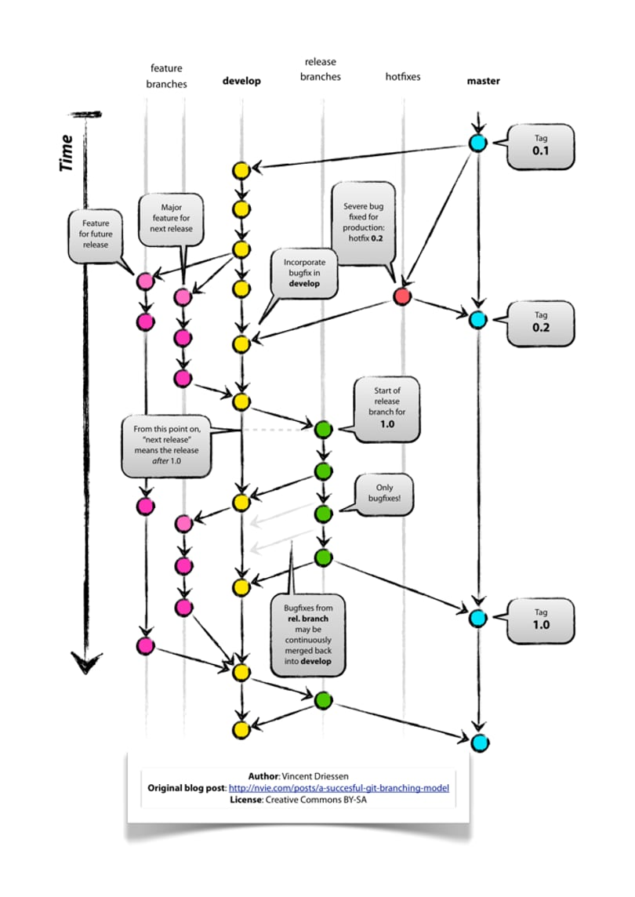

# git conventions


## Branching model:

We'll follow the Git flow branching model:



Notes:
* to reduce spending, only development, release and master branches will be tested.
* 


### master branch:
    the master branch will hold the production code.

### development branch:
    this branch should be used to store features that have completed development cycle and are ready for testing.
    The merges will only happen through Pull requests which are reviewed and tested. 
  
### feature branches: 
    branch from the develop branch and merge it back to development
    
### release branches:
    starts from develop and signifies that there will be a new release once we merge this branch into master.
    merges into master and development

### hotfix branches:
    no tests and will only be allowed under exceptional circumstances with manual testing
    merged into master, development.
 
 
## CI/CD setup

* Automated testing for development and release branches but no deployment.
* Test and deploy on merge to master


## Deployment:
* conda packages
* pypi packages
* docker containers


## Commit messages


### commit message header:

format:
```
title: summary

Explanation
```

*Title:*

* under 3-4 words, concise explanation

*summary*
* short 50-ish word summary


*Explanation*: (optional but encouraged)

 when a commit merits a bit of explanation and context, you can write a body.
 This is optional
 
 
 
 
 
 Notes:
 
 * capitalize title, summary and explanation
 * do not end summary with a period
 * wrap the explanation at 72 chars
 
 
 
 
 ## Rebase or Merge
 
 Always rebase, no merges. :) 